# 资料
[视频(尚硅谷Vue2.0+Vue3.0全套教程丨vuejs从入门到精通)](https://www.bilibili.com/video/BV1Zy4y1K7SH/?spm_id_from=333.999.0.0&vd_source=56899dea646547051c5cf13d624feb11)
[文档(Vue官方)](https://v2.cn.vuejs.org/v2/guide/index.html)

# Vue是什么？
一套用于**构建用户界面**的**渐进式**JavaScript框架
数据――>界面
# Vue的特点
1、组件化：Vue(html css js)

2.声明式（与原生JS的命令式形成对比）
3.使用**虚拟DOM+**优秀的**Diff算法**，尽量复用DOM节点

# Vue的开发环境配置
1.下载开发版本
2.安装谷歌插件
3.利用ProductionTip解决提示问题
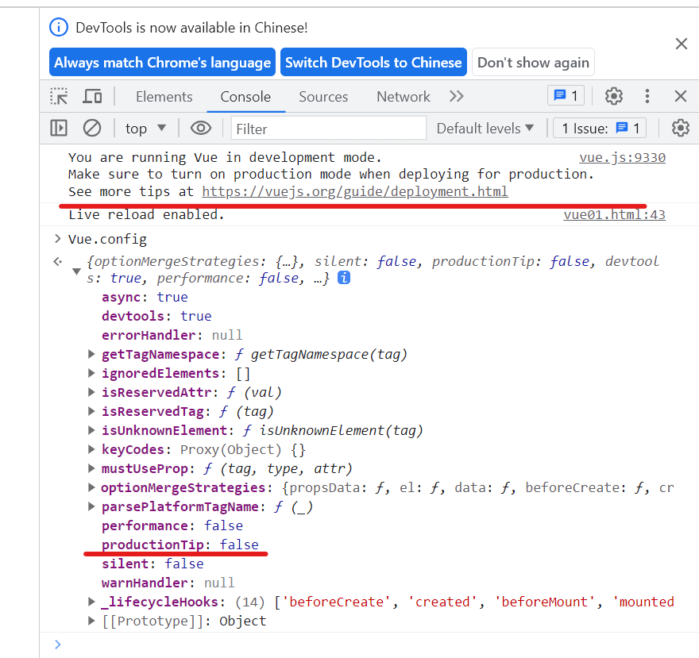
**为什么把ProductionTip的值改成了fales还是出现提示？**
# 初识Vue
## Hello实例
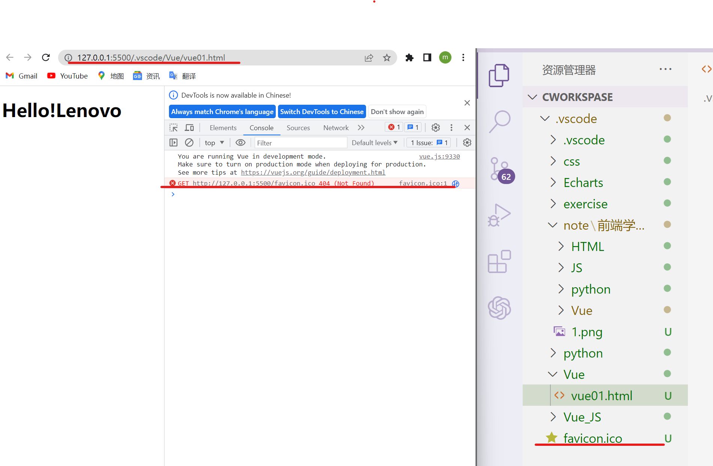
**为什么加上favicon.ico标签还是报错？**
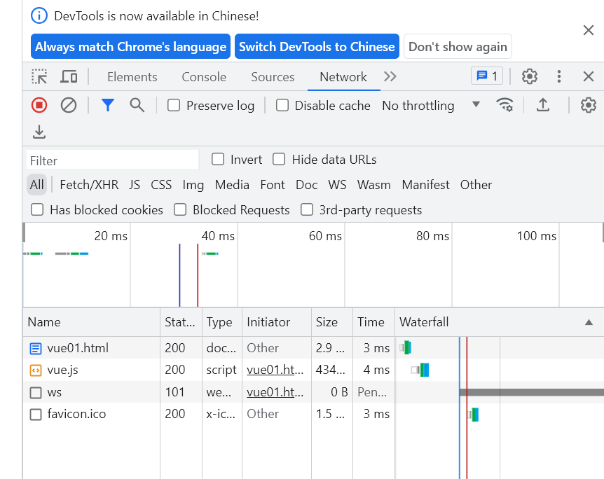
我把标签放到Vue文件夹里后发现没用，又转回了原先位置，发现报错没有了
总结：
>1.想让Vue工作，就必须创建一个Vue实例，且要传入一个配置对象：
2.root容器里的代码依然符合html规范，只不过混入了一些特殊的Vue语法；
3.root容器里的代码被称为[Vue模板]；
4.Vue实例和容器是一一对应的；
5.真实开发中只有一个Vue实例，并且会配合着组件一起使用；
6.({xxx)}中的xxx要写js表达式，且xxx可以自动读取到ata中的所有属性；
7.一旦data中的数据发生改变，那么模板中用到该数据的地方也会自动更新。

注意区分：js表达式和js代码（语句）
>1,表达式：一个表达式会生成一个值，可以放在任何一个需要值的地方：
(1)a
(2)a+b
(3)demo(1)
(4)X==y?'a':'b'
2.js代码（语句）
(1)if(){}
(2)for(){}
# 模板语法
>1.插值语法：
功能：用于解析标签体内容。
写法：{{xxx}},xxx是js表达式，且可以直接读取到data中的所有属性。
2.指令语法：
功能：用于解析标签(包括：标签属性、标签体内容、绑定事件，・・・，)
举例：v-bind:href="xxx"或简写为：href="xxx",xxx同样要写js表达式，
且可以直接读取到data中的所有属性。
备注：Vue中有很多的指令，且形式都是：v-???,此处我们只是拿v-bind举个例子。

exe:
~~~
<body>
    <!-- 准备一个容器 -->
    

        <!-- 插值语法 -->
        <h1>Hello!{{name}}</h1>
        <!-- 指令语法 -->
        <a :href="url">点我学习模板语法</a>
    

    
</body>

~~~
# 数据绑定
>Vue中有2种数据绑定的方式：
1.单向绑定(v-bind):数据只能从data流向页面。
2.双向绑定(v-model):数据不仅能从data流向页面，还可以从页面流向data.
备注：
1,双向绑定一般都应用在表单类元素上(如：input、select等)
2.v-model:value可以简写为v-model,因为v-model默认收集的就是value值。

exe
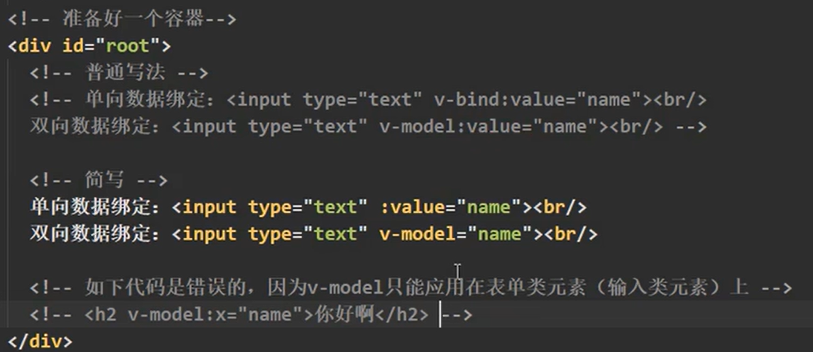
# el 和 data 的两种写法
**el**
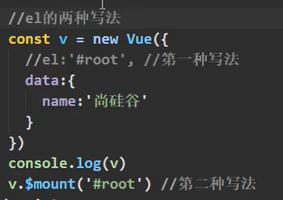
**data**
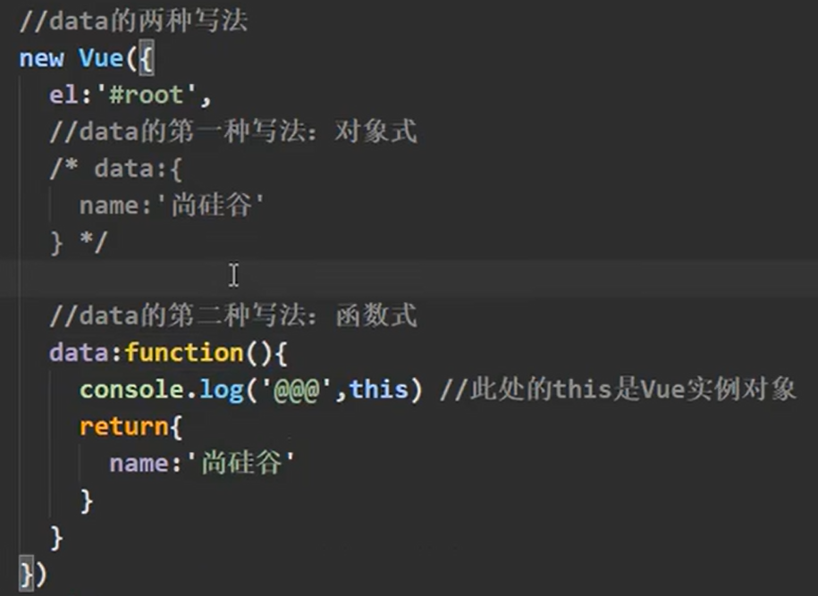
简写
~~~
data(){
return{}
}
~~~
总结
>1.e1有2种写法
(1)new Vuel时候配置el属性。
(2)先创建Vue实例，随后再通过vm.$moun('#root')指定el的值。
2.data有2种写法
(1)对象式
(2)函数式
如何选择：目前哪种写法都可以，以后学习到组件时，data必须使用函数式，否则会报错。
3.一个重要的原则：
Vue管理的函数，一定不要写箭头函数，一旦写了箭头函数，this就不再是Vue实例了。
# MVVM模型
1.M:模型(Mode1):data中的数据
2.V:视图(View):模板代码
3.VM:视图模型(ViewModel):Vue实例
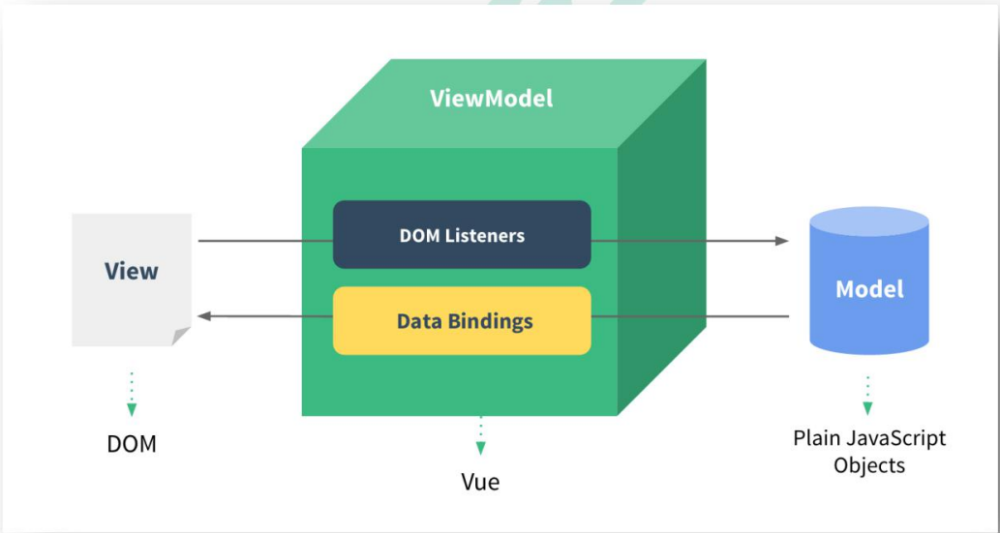
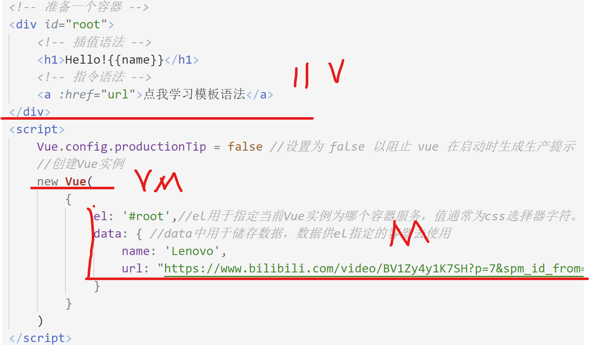
观察发现：
1.data中所有的属性，最后都出现在了vm身上。
2.vm身上所有的属性及Vue原型上所有属性，在Vue模板中都可以直接使用。
# 数据代理
## 回顾Object.definneProperty方法
~~~
 let number = 18
        let person = {
            name: '张山',
            sex: '男'
        }
        Object.defineProperty(person, 'age', {
            // 当有人读取person的age属性时，get函数（getter）就会被调用，且返回值就是age的值
            get: function () {
                // console.log('有人读取age属性了')
                return number
            },
            //当有人修改personi的age属性时，set函数(setter)就会被调用，且会收到修改的具体值
            set(value) {
                console.log("有人修改了age属性,且值是", value)
                number = value

            }
~~~
## Vue中的数据代理：
>通过vm对象来代理data对象中属性的操作(读/写)
2.Vue中数据代理的好处：
更加方便的操作data中的数据
3.基本原理：
通过Object.defineProperty（）把data对象中所有属性添加到vm上。
为每一个添加到vm上的属性，都指定一个getter/setter。
在getter/setter内部去操作(读/写)data中对应的属性。

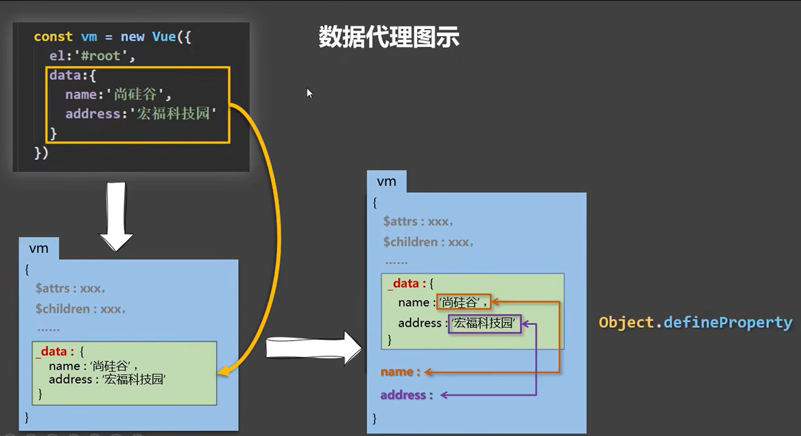
**对此图我的理解**
1.当我们写入data中的数据时，vm中会复制一份到_data中，如果没有数据代理的话，在使用{{}}时，必须写成{{_data.name}}才可以使用；
2.因为有数据代理，_data里的数据会读取一份直接在vm里，所以可以直接用{{name}};
3._data里的数据会读取一份直接在vm里,使用的是vm里的grtter，如果更改，就是用的是setter。
# 事件处理
## 事件的基本使用：
>1.使用v-on:xxx或@xxx绑定事件，其中xxx是事件名;
2.事件的回调需要配置在methods对象中，最终会在vm上;
3.methods中配置的函数，不要用箭头函数！否则this就不是vm了;
4.methods中配置的函数，都是被Vue所管理的函数，this的指向是vm或组件实例对象;
5.@click="demo”和@click="demo(Sevent)"效果一致，但后者可以传参;
## 事件修饰符

>1.prevent:阻止默认事件（常用）；
2.stop:阻止事件冒泡（常用）;
3.once:事件只触发一次（常用）;
4.capture:使用事件的捕获模式;
5.self:只有event.target是当前操作的元素时才触发事件;
6.passive:事件的默认行为立即执行，无需等待事件回测执行完毕;
## 键盘事件
>1.Vue中常用的按键别名：
网车=>enter
则除=>delet
(捕获“刷除”和“迟格”健)
退出=>
esc
空格=>space
换行=>tab(特殊，必须配合keydown去使用)
上=>up
下=>down
左=>1eft
右=>right
2.Vue未提供别名的按健，可以使用按健原始的key值去你定，但注意要转为kebab-case（短横线命名）
3.系统修饰键（用法特殊）：ctrl、a1t、shift、meta
(1)配合kyup使用：按下修饰健的同时，再按下其他健，随后释放其他健，事件才鼓触发。
(2)配合keydown使用：正常触发事件。
4.也可以使用keyCode去指定具体的按健（不推荐）
5.Vue,config.keyCodes,自定义键名=键码，可以去定制按键别名
# 计算属性
计算属性：
1.定义：要用的属性不存在，要通过已有属性计算得来。
2.原理：底层借助了Objcet.defineproperty方法提供的getter和setter.
3.get函数什么时候执行？
(1)初次读取时会执行一次。
(2)当依赖的数据发生改变时会被再次调用。
4.优势：与methods实现相比，内部有缓存机制（复用），效率更高，调试方便。
5.备注：
1.计算属性最终会出现在vm上，直接读取使用即可。
2.如果计算属性要被修改，那必须写set函数去响应修改，且set中要引起计算时依赖的数据发生改变。
**exe**
~~~
 <!-- 创建一个容器 -->
    

        姓：<input type="text" v-model="firstName"> 
        名：<input type="text" v-model="lastName"> 
        全名：{{fullName}}
    

    
~~~
setter(不常用)
~~~
set(value){
console.log('set',value)
const arr = value.split('-')
this.firstName arr[0]
this.lastName arr[1]
//set中要引起计算时依赖的数据发生改变
}
~~~
# 监视属性watch
1.当被监视的属性变化时，回调函数handler自动调用，进行相关操作
2.监视的属性必须存在，才能进行监视！！
3.监视的两种写法：
(1)new Vue时传入watch配置
~~~
Vue
watch:{
    info:{
    //
    }
}
~~~
(2).通过vm.$watch监视
~~~
vm.$watch('shuxing','watch的shuxing里的内容')
~~~
深度监视：
>(1).Vue中的watch默认不监测对象内部值的改变（一层）。
(2).配置deep:true可以监测对象内部值改变（多层）。
备注：
(1).Vue自身可以监测对象内部值的改变，但Vue提供的watch默认不可以！
(2).使用watch时根据数据的具体结构，决定是否采用深度监视。

简写
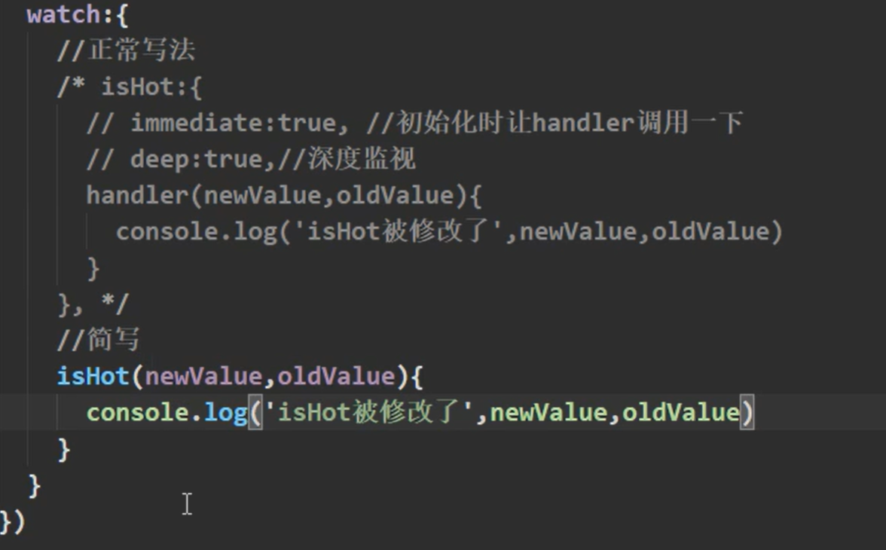
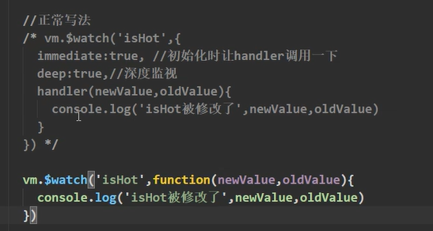
computed.和watch.之间的区别：
>1.computed能完成的功能，watch都可以完成。
2,watch能完成的功能，computed不一定能完成，例如：watch可以进行异步操作。
两个重要的小原则：
1.所被Vue管理的函数，最好写成普通函数，这样this的指向才是vm或组件实例对象。
2.所有不被Vue所管理的函数(定时器的回调函数、ajax的回调函数等)，最好写成箭头函数，
这样this的指向才是vm或组件实例对象。
# 绑定样式
1.c1ass样式
写法：class="xxx"xxx可以是字符串、对象、数组。
字符串写法适用于：类名不确定，要动态获取。
对象写法适用于：要绑定多个样式，个数不确定，名字也不确定。
数组写法适用于：要绑定多个样式，个数确定，名字也确定，但不确定用不用。
2.style样式
:style="{fontsize:xxx}"其中xxx是动态值。
:style="[a,b]"其中a、b是样式对象。
# 条件渲染
1.**v-if**
写法：
(1).v-if="表达式"
(2).v-else-if="表达式"
(3).v-else="表达式"
适用于：切换频率较低的场景。
特点：不展示的D0M元素直接被移除。
注意：v-if可以和：**v-else-if**、**v-else**一起使用，但要求结构不能被“打断”。
2.**v-show**
写法：V-show="表达式"
适用于：切换频率较高的场景。
特点：不展示的D0M元素未被移除，仅仅是使用样式隐藏掉
3.备注：使用v-if的时，元素可能无法获取到，而使用v-show一定可以获取到。
# 列表渲染
## 基本列表
常用例子--遍历数组、对象
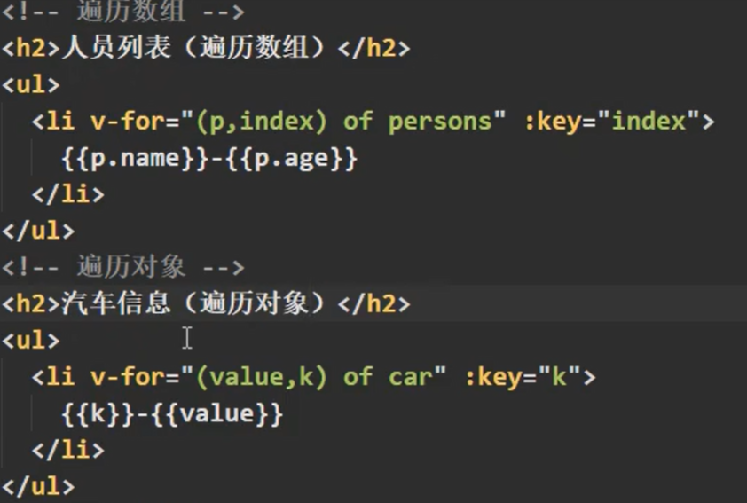
**总结**
v-for指令
1.用于展示列表数据
2.语法：v-for="(item,index)in xxx"          :key="yyy"
3.可遍历：数组、对象、字符串（用的很少）、指定次藏（用的很少）
## key的原理
1.虚拟D0M中key的作用：
>key是虚拟DOM对象的标识，当数据发生变化时，Vue会根据【新数据】生成[新的虚拟DoM]，随后Vue进行[新虚拟DoM]与[旧虚拟DoM]的差异比较，比较规则如下;

2.对比规则：
>(1)旧虚拟DOM中找到了与新虚拟DOM相同的key:
a.若虚拟DOM中内容没变，直接使用之前的真实DOM!
b.若虚拟DOM中内容变了，则生成新的真实DOM,随后替换掉页面中之前的真实DOM.
(2)旧虚拟DOM中未找到与新虚拟DOM相园的key
创建新的真实DOM,随后渲染到到页面。

3.用index作为key可能会引发的问题：
>1.若对数据进行：逆序添加、逆序删除等破坏顺序操作：
   会产生没有必要的真实DOM更新=>界面效果没问题，但效率低。
2.如果结构中还包含输入类的DOM:
    会产生错误DOM更新==>界面有问题。

4.开发中如何选择key?:
>1.最好使用每条数据的唯一标识作为key,比如id、手机号、身份证号、学号等唯一值。
2.如果不存在对数据的逆序添加、逆序删除等破坏顺序操作，仅用于渲染列表用于展示，使用index作为Key是没有问题的。

**遍历列表时key的作用(id作为key)**
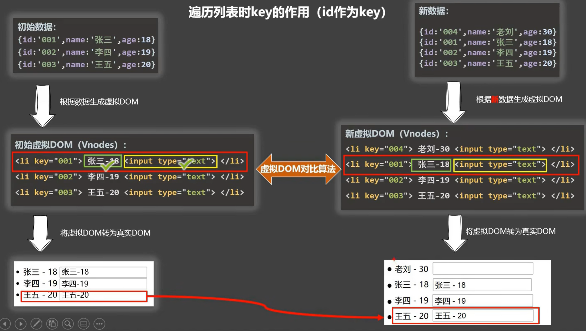
**遍历列表时key的作用(index作为key)**
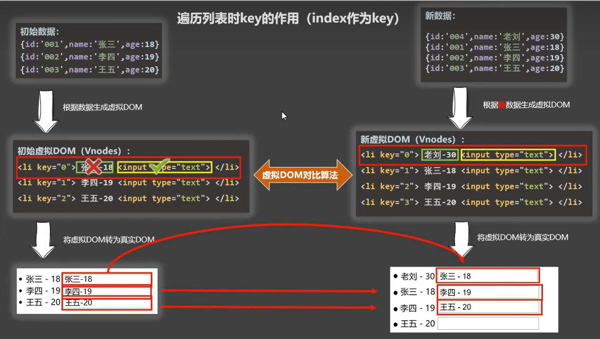

## 列表过滤
watch方法
~~~
vue
<body>
    

        <input type="text" placeholder="请输入姓名" v-model="keyWord">
        <ul>
            <li v-for="p of filPersons">
                {{p.name}}
            </li>
        </ul>
    

    
</body>

~~~
computed方法
~~~
vue
            computed: {
                filPersons() {
                    return filPersons = this.persons.filter((p) => {
                        return p.name.indexOf(this.keyWord) !== -1
                    })
                }

            }
~~~
## 列表排序
~~~
vue
<body>
    

        <input type="text" placeholder="请输入姓名" v-model="keyWord">
        <button @click="sortType=2">年龄升序</button>
        <button @click="sortType=1">年龄降序</button>
        <button @click="sortType=0">原顺序</button>
        <ul>
            <li v-for="p of filPersons">
                {{p.name}}--{{p.age}}
            </li>
        </ul>
    

    
</body>

~~~
# Vue监测数据
## 提出数组更新时的一个问题
~~~
Vue
method:{
    updataM:{
        this.person.name = xx, //有效
        this.person = [xx] //无效
    }
}
~~~
## Vue监测数据的原理_对象
~~~
Vue
Vue.set(vm._data.sx,'xx','x')
~~~
## Vue监测数据的原理_数组
~~~
Vue
vm._data.arr.push('xxx')
//shift.......
~~~
## Vue监视数据的原理总结
1.vue会监视data中所有层次的数据。
2.如何监测对象中的数据？
>通过setter实现监视，且要在new Vue时就传入要监测的数据。
(1)对象中后追加的属性，Vue默认不做响应式处理
(2)如需给后添加的属性做响应式，请使用如下API:
Vue.set(target,propertyName/index,value)
或
vm.$set(target,propertyName/index,value)

3.如何监测数组中的数据？
>通过包裹数组更新元素的方法实现，本质就是做了两件事：
(1).调用原生对应的方法对数组进行更新。
(2).重新解析模板，进而更新页面。

4.在Vue修改数组中的某个元素一定要用如下方法：
>1.使用这些API:push（）、pop（）、shift（）、unshift（）、splice（）、sort（）、reverse（）
2.Vue.set（）vm.$set（）
特别注意：Vue.set（）和vm.$set（）不能给vm或vm的根数据对象添加属性！

复刻个简单的deom
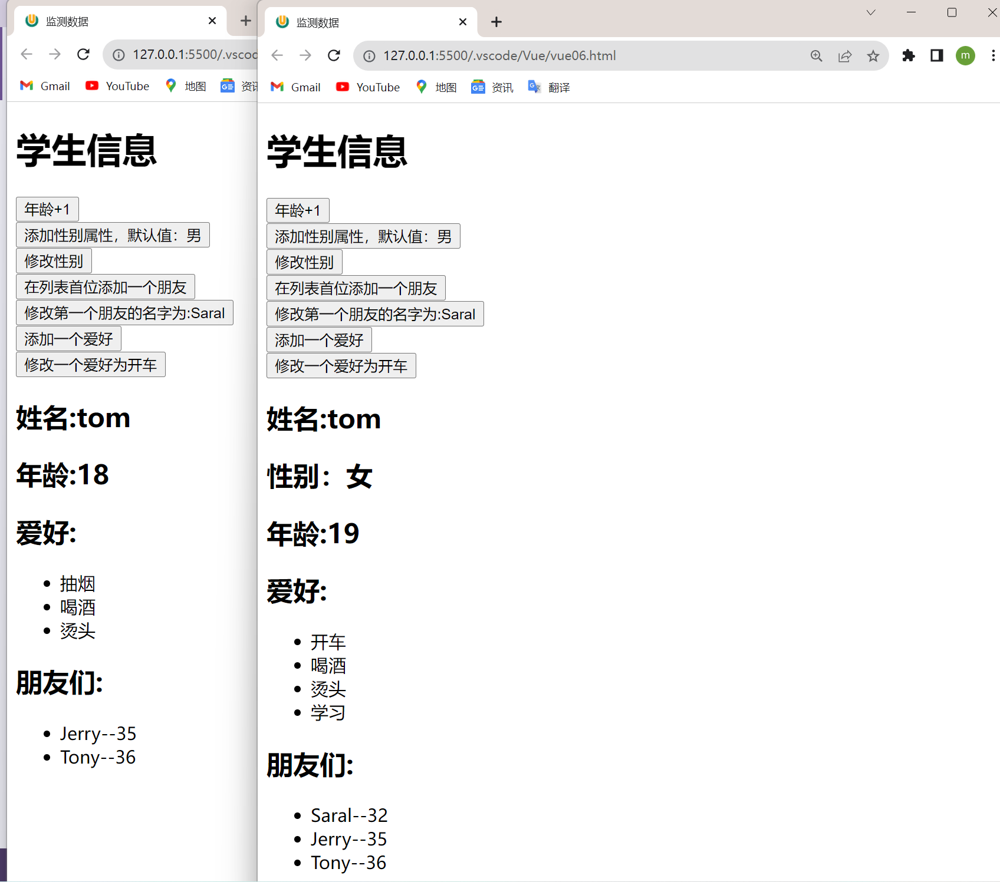
~~~
Vue
<body>
    

        <h1>学生信息</h1>
        <button @click="student.age++">年龄+1</button> 
        <button @click="addSex">添加性别属性，默认值：男</button> 
        <button @click="updataSex">修改性别</button> 
        <button @click="addFriend">在列表首位添加一个朋友</button> 
        <button @click="updataFristfriend">修改第一个朋友的名字为:Saral</button> 
        <button @click="addHobby">添加一个爱好</button> 
        <button @click="updataHobby">修改一个爱好为开车</button> 
        <!-- <button>过滤掉爱好中的抽烟</button>  -->
        <h2>姓名:{{student.name}}</h2>
        <h2 v-if="student.sex">性别：{{student.sex}}</h2>
        <h2>年龄:{{student.age}}</h2>
        <h2>爱好:</h2>
        <ul>
            <li v-for="(h,index) in student.hobby" :key="index">
                {{h}}
            </li>
        </ul>
        <h2>朋友们:</h2>
        <ul>
            <li v-for="(f,index) in student.friends" :key="index">
                {{f.name}}--{{f.age}}
            </li>
        </ul>
    

    
</body>
~~~
# 收集表单数据
代码
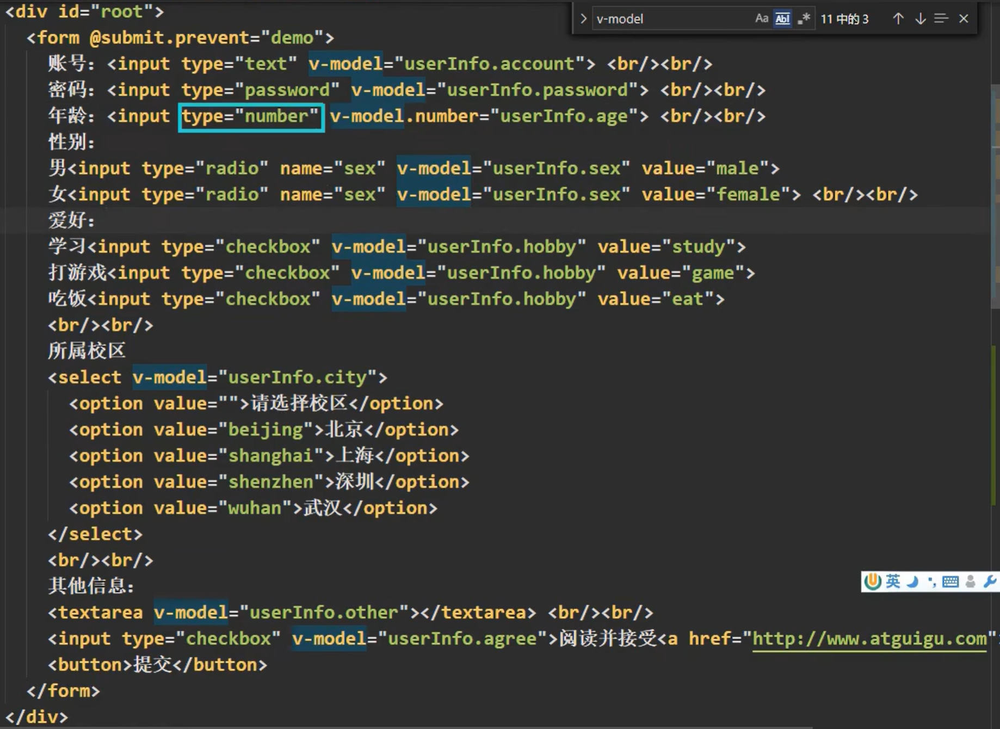
**总结**
>若：< input type="text"/>,则v-model收集的是value值，用户输入的就是value值。

>若：< input type:="radio"/>,则v-model收集的是value值，且要给标签配置value值。

>若：< input type="checkbox"/>
1.没有配置input的value/属性，那么收集的就是checked(勾选or未勾选，是布尔值)
2.配置input的value属性：
(1)v-model的初始值是非数组，那么收集的就是checked(勾选or未勾选，
是布尔值）
(2)v-mode1的初始值是数组，那么收集的的就是value组成的数组

备注：v-model的三个修饰符：
>1azy:失去焦点再收集数据
number:输入字符串转为有效的数字
trim:输入首尾空格过滤

# 过滤器
**定义**：对要显示的数据进行特定格式化后再显示（适用于一些简单逻辑的处理）
**语法**：
>1.注册过滤器：Vue.filter(name,cal1back)或new Vue{filters:{)}
2.使用过滤器：（xxx|过滤器名}或v-bind:属性="xxx|过滤器名"

**备注**：
>1.过滤器也可以接收额外参数、多个过滤器也可以串联
2.并没有改变原本的数据，是产生新的对应的数据

# 指令
## 内置指令
v-bind：单向绑定解析表达式，可简写为XXX
v-model:双向数据绑定
v-for：遍历数组/对象/字符串
v-on：绑定事件监听，可简写为@
v-if：条件渲染（动态控制节点是否存存在）
v-else：条件渲染（动态控制节点是否存存在）
v-show：条件渲染（动态控制节点是否展示）
v-text指令：
>1.作用：向其所在的节点中渲染文本内容。
2.与插值语法的区别：v-text会替换掉节点中的内容，(xx)}则不会。

v-html指令：
>1.作用：向指定节点中渲染包含html结构的内容。
2.与插值语法的区别：
(1).v-htm1会替换掉节点所有的内容，（xx}则不会。
(2).v-html可以识别html结构。
3.严重注意：v-html有安全性问题！！！！
(1).在网站上动态渲染任意HTML是非常危险的，容易导致**XSS攻击**。
(2).一定要在可信的内容上使用v-html,永不要用在用户提交的内容上！

**补充cookie**
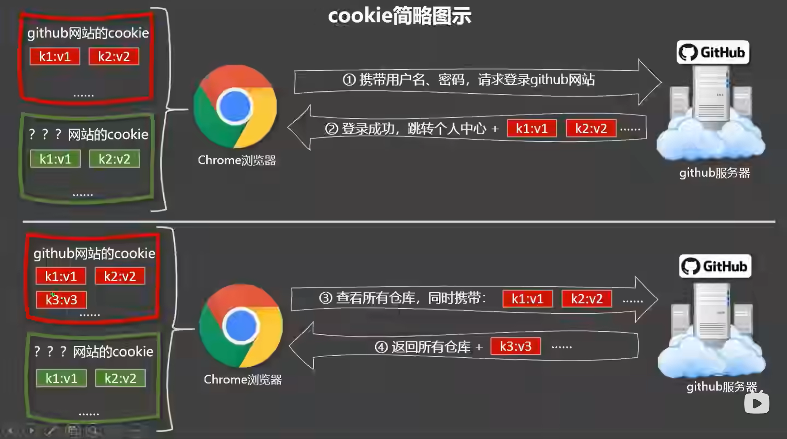

v-c1oak指令（没有值）：
>1.本质是一个特殊属性，Vue实例创建完毕并接管容器后，会删掉v-c1oak属性。
2.使用css配合v-c1oak可以解决网速慢时页面展示出(xxx)的问题。

v-once指令：
>1.v-once所在节点在初次动态渲染后，就视为静态内容了。
2.以后数据的改变不会引起v-once所在结构的更新，可以用于优化性能。

v-pre指令：
>1.跳过其所在节点的编译过程。
2.可利用它跳过：没有使用指令语法、没有使用插值语法的节点，会加快编译。

## 自定义指令
定义语法：
>(1).局部指令：
new Vue({
directives:{指令名：配置对象}
})
或
new Vue({
directives{指令名：回调函数}
})
(2).全局指令：
Vue.directive(指令名，配置对象)
或
Vue,directive(指令名，回调函数)

配置对象中常用的3个回调：
>(1).bind:指令与元素成功绑定时调用。
(2).inserted:指令所在元素被插入页面时调用。
(3).update:指令所在模板结构被重新解析时调用。

三、备注：
>1,指令定义时不加V-,但使用时要加V-:
2,指令名如果是多个单词，要使用kebab-case命名方式，不要用camelCase命名。
