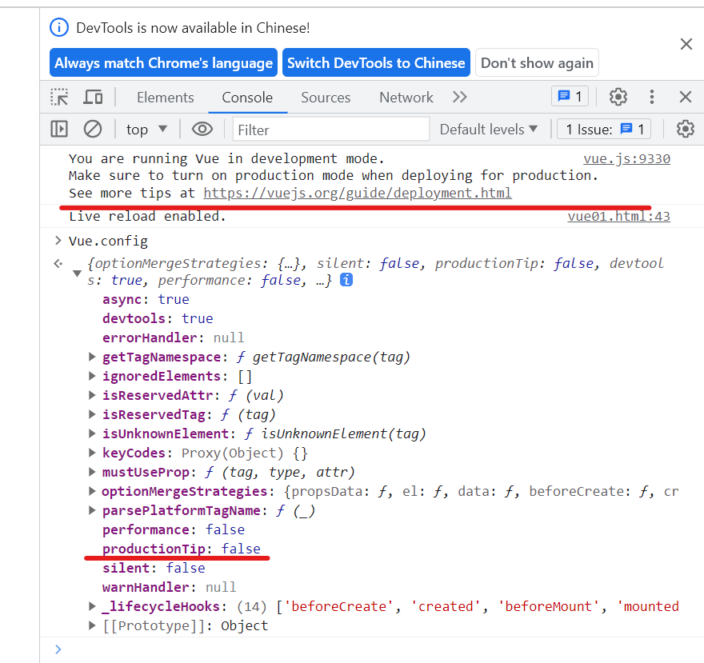
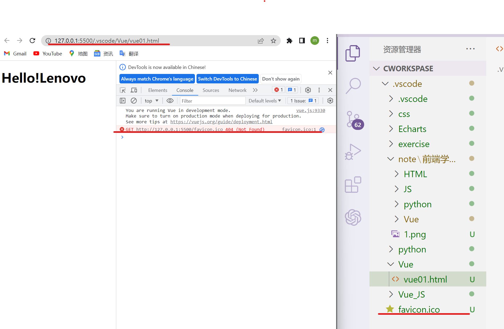
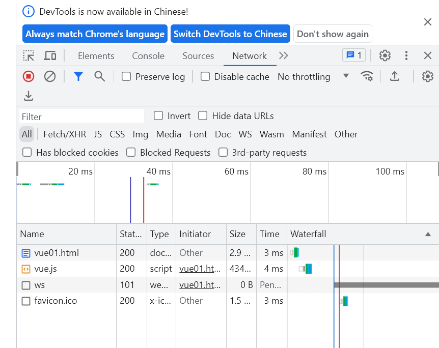
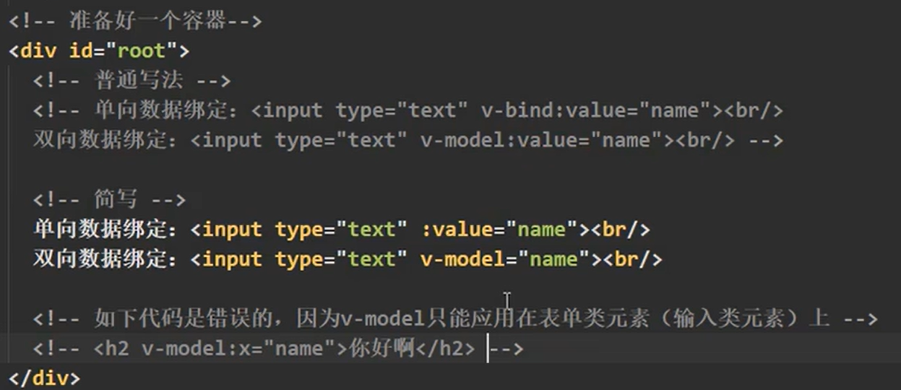
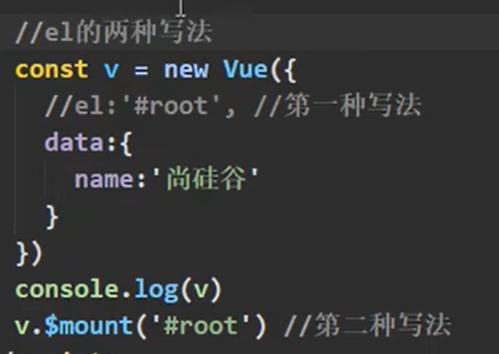
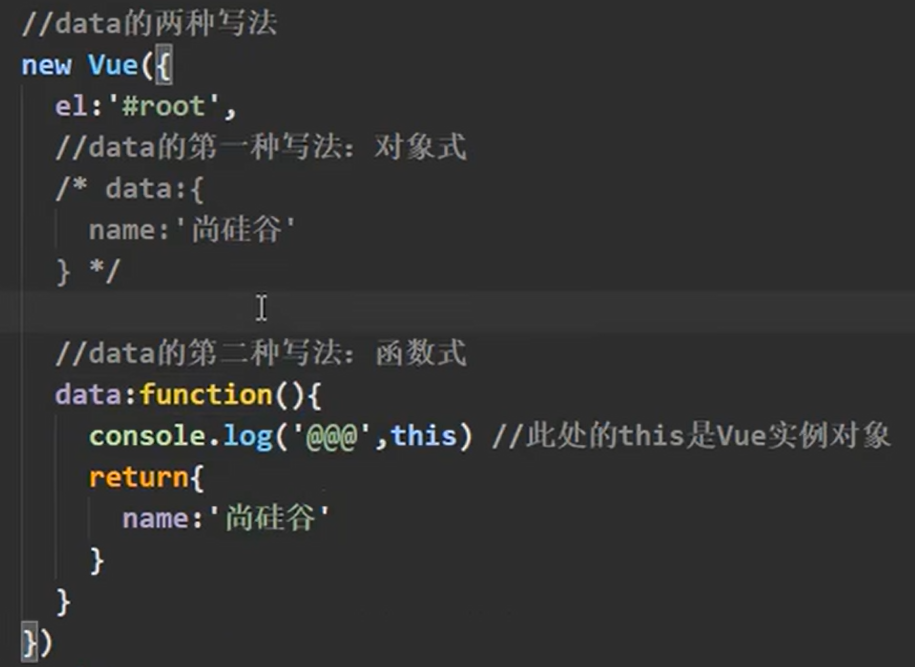
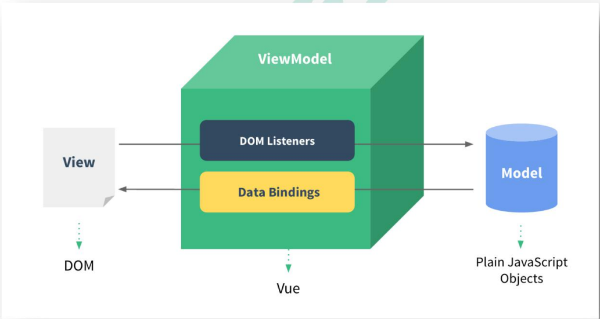
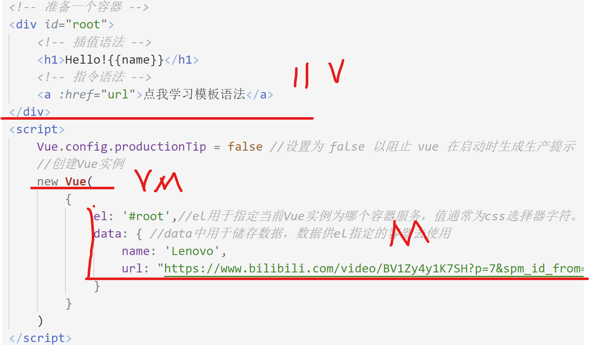
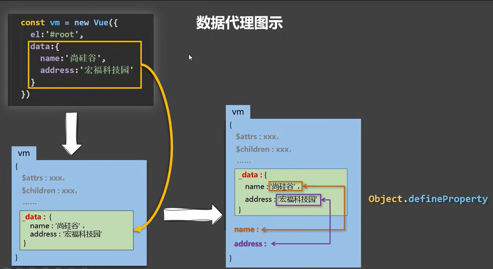

# 资料
[视频(尚硅谷Vue2.0+Vue3.0全套教程丨vuejs从入门到精通)](https://www.bilibili.com/video/BV1Zy4y1K7SH/?spm_id_from=333.999.0.0&vd_source=56899dea646547051c5cf13d624feb11)
[文档(Vue官方)](https://v2.cn.vuejs.org/v2/guide/index.html)

# Vue是什么？
一套用于**构建用户界面**的**渐进式**JavaScript框架
数据——>界面
# Vue的特点
1、组件化：Vue(html css js)

2.声明式（与原生JS的命令式形成对比）
3.使用**虚拟DOM+**优秀的**Diff算法**，尽量复用DOM节点

# Vue的开发环境配置
1.下载开发版本
2.安装谷歌插件
3.利用ProductionTip解决提示问题

**为什么把ProductionTip的值改成了fales还是出现提示？**
# 初识Vue
## Hello实例

**为什么加上favicon.ico标签还是报错？**

我把标签放到Vue文件夹里后发现没用，又转回了原先位置，发现报错没有了
总结：
>1.想让Vue工作，就必须创建一个Vue实例，且要传入一个配置对象：
2.root容器里的代码依然符合html规范，只不过混入了一些特殊的Vue语法；
3.root容器里的代码被称为[Vue模板]；
4.Vue实例和容器是一一对应的；
5.真实开发中只有一个Vue实例，并且会配合着组件一起使用；
6.({xxx)}中的xxx要写js表达式，且xxx可以自动读取到ata中的所有属性；
7.一旦data中的数据发生改变，那么模板中用到该数据的地方也会自动更新。

注意区分：js表达式和js代码（语句）
>1,表达式：一个表达式会生成一个值，可以放在任何一个需要值的地方：
(1)a
(2)a+b
(3)demo(1)
(4)X==y?'a':'b'
2.js代码（语句）
(1)if(){}
(2)for(){}
# 模板语法
>1.插值语法：
功能：用于解析标签体内容。
写法：{{xxx}},xxx是js表达式，且可以直接读取到data中的所有属性。
2.指令语法：
功能：用于解析标签(包括：标签属性、标签体内容、绑定事件，···，)
举例：v-bind:href="xxx"或简写为：href="xxx",xxx同样要写js表达式，
且可以直接读取到data中的所有属性。
备注：Vue中有很多的指令，且形式都是：v-???,此处我们只是拿v-bind举个例子。

exe:
~~~
<body>
    <!-- 准备一个容器 -->
    

        <!-- 插值语法 -->
        <h1>Hello!{{name}}</h1>
        <!-- 指令语法 -->
        <a :href="url">点我学习模板语法</a>
    

    
</body>

~~~
# 数据绑定
>Vue中有2种数据绑定的方式：
1.单向绑定(v-bind):数据只能从data流向页面。
2.双向绑定(v-model):数据不仅能从data流向页面，还可以从页面流向data.
备注：
1,双向绑定一般都应用在表单类元素上(如：input、select等)
2.v-model:value可以简写为v-model,因为v-model默认收集的就是value值。

exe

# el 和 data 的两种写法
**el**

**data**

简写
~~~
data(){
return{}
}
~~~
总结
>1.e1有2种写法
(1)new Vuel时候配置el属性。
(2)先创建Vue实例，随后再通过vm.$moun('#root')指定el的值。
2.data有2种写法
(1)对象式
(2)函数式
如何选择：目前哪种写法都可以，以后学习到组件时，data必须使用函数式，否则会报错。
3.一个重要的原则：
Vue管理的函数，一定不要写箭头函数，一旦写了箭头函数，this就不再是Vue实例了。
# MVVM模型
1.M:模型(Mode1):data中的数据
2.V:视图(View):模板代码
3.VM:视图模型(ViewModel):Vue实例

观察发现：
1.data中所有的属性，最后都出现在了vm身上。
2.vm身上所有的属性及Vue原型上所有属性，在Vue模板中都可以直接使用。
# 数据代理
## 回顾Object.definneProperty方法
~~~
 let number = 18
        let person = {
            name: '张山',
            sex: '男'
        }
        Object.defineProperty(person, 'age', {
            // 当有人读取person的age属性时，get函数（getter）就会被调用，且返回值就是age的值
            get: function () {
                // console.log('有人读取age属性了')
                return number
            },
            //当有人修改personi的age属性时，set函数(setter)就会被调用，且会收到修改的具体值
            set(value) {
                console.log("有人修改了age属性,且值是", value)
                number = value

            }
~~~
## Vue中的数据代理：
>通过vm对象来代理data对象中属性的操作(读/写)
2.Vue中数据代理的好处：
更加方便的操作data中的数据
3.基本原理：
通过Object.defineProperty（）把data对象中所有属性添加到vm上。
为每一个添加到vm上的属性，都指定一个getter/setter。
在getter/setter内部去操作(读/写)data中对应的属性。

**对此图我的理解**
1.当我们写入data中的数据时，vm中会复制一份到_data中，如果没有数据代理的话，在使用{{}}时，必须写成{{_data.name}}才可以使用；
2.因为有数据代理，_data里的数据会读取一份直接在vm里，所以可以直接用{{name}};
3._data里的数据会读取一份直接在vm里,使用的是vm里的grtter，如果更改，就是用的是setter。
# 事件处理
## 事件的基本使用：
>1.使用v-on:xxx或@xxx绑定事件，其中xxx是事件名;
2.事件的回调需要配置在methods对象中，最终会在vm上;
3.methods中配置的函数，不要用箭头函数！否则this就不是vm了;
4.methods中配置的函数，都是被Vue所管理的函数，this的指向是vm或组件实例对象;
5.@click="demo”和@click="demo(Sevent)"效果一致，但后者可以传参;
## 事件修饰符

>1.prevent:阻止默认事件（常用）；
2.stop:阻止事件冒泡（常用）;
3.once:事件只触发一次（常用）;
4.capture:使用事件的捕获模式;
5.self:只有event.target是当前操作的元素时才触发事件;
6.passive:事件的默认行为立即执行，无需等待事件回测执行完毕;
## 键盘事件
>1.Vue中常用的按键别名：
网车=>enter
则除=>delet
(捕获“刷除”和“迟格”健)
退出=>
esc
空格=>space
换行=>tab(特殊，必须配合keydown去使用)
上=>up
下=>down
左=>1eft
右=>right
2.Vue未提供别名的按健，可以使用按健原始的key值去你定，但注意要转为kebab-case（短横线命名）
3.系统修饰键（用法特殊）：ctrl、a1t、shift、meta
(1)配合kyup使用：按下修饰健的同时，再按下其他健，随后释放其他健，事件才鼓触发。
(2)配合keydown使用：正常触发事件。
4.也可以使用keyCode去指定具体的按健（不推荐）
5.Vue,config.keyCodes,自定义键名=键码，可以去定制按键别名
# 计算属性
计算属性：
1.定义：要用的属性不存在，要通过已有属性计算得来。
2.原理：底层借助了Objcet.defineproperty方法提供的getter和setter.
3.get函数什么时候执行？
(1)初次读取时会执行一次。
(2)当依赖的数据发生改变时会被再次调用。
4.优势：与methods实现相比，内部有缓存机制（复用），效率更高，调试方便。
5.备注：
1.计算属性最终会出现在vm上，直接读取使用即可。
2.如果计算属性要被修改，那必须写set函数去响应修改，且set中要引起计算时依赖的数据发生改变。
**exe**
~~~
 <!-- 创建一个容器 -->
    

        姓：<input type="text" v-model="firstName"> 
        名：<input type="text" v-model="lastName"> 
        全名：{{fullName}}
    

    
~~~
setter(不常用)
~~~
set(value){
console.log('set',value)
const arr = value.split('-')
this.firstName arr[0]
this.lastName arr[1]
//set中要引起计算时依赖的数据发生改变
}
~~~